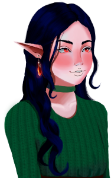

# Lia na Floresta Mágica
Jogo desenvolvido para LAJE no processo seletivo da [GDP UFRJ](https://gdpufrj.itch.io/)

## Sinopse
Lia é uma adolescente meio-elfa que vive com sua mãe em uma cabana aconchegante. Mas devido a uma doença que sua mãe pegou chamada *doença do slime*, Lia precisa se aventurar até a floresta élfica e encontrar com seu tio Frey para pegar o remédio.

## Membros
<ul style="list-style-position: inside;">
  <li>Programador: <a href="https://devdiegomatos.com.br">Diego V. S. de Matos</a></li>
  <li>Artistas: <a href="https://instagram.com/foxholtz">Nicholas</a> e <a href="https://www.behance.net/dandaodara">Dandara</a> (<a href="https://www.instagram.com/danda.odara">@danda.odara</a>)</li>
  <li>Músicos: <a href="https://soundcloud.com/trine_sheep">Patrine</a></li>
  <li>Roteirista: <a href="https://itch.io/profile/besouro">Vitor Besouro</a></li>
</ul>

## Como Jogar
<ul style="list-style-position: inside;">
  <li>Use A e D ou Seta para Direita e Seta para Esquerda para se mover.</li>
  <li>Espaço ou Seta para Cima para pular</li>
  <li>ESC para pausar</li>
  <li>Tecla E para interagir com os NPCs</li>
</ul>

## Plataforma
Windows

## Página no itch.io
https://gdpufrj.itch.io/laje-4

## Repositório
https://github.com/Espetinho-de-Legumes/Lia-na-Floresta-Magica

# Versões
## 1.0.1
### Correção de Bugs
* Corrigido problema de quando morria nascia no lugar errado.
* Corrigido botão de sair do jogo que não funcionava.
* Corrigido problemas que as minhocas da quest do Jotaro não eram descontadas.
* Jogador refatorado.
* Corrigido problema do pulo que fazia parecer que o jogador "batia" no teto.
### Implementado
* Agora ocorre um fade-in / fade-out entre as músicas do jogo.
* Para deixar o jogo mais fácil, foi retirado a tela de Game Over e adicionado um contador de mortes.
* Os passos possuem sons diferentes dependendo da surperfície.
* Movimentação alterada.
* Adicionado um efeito de *digitação* no diálogo.
* Ao completar uma quest voce ganha uma estrela
